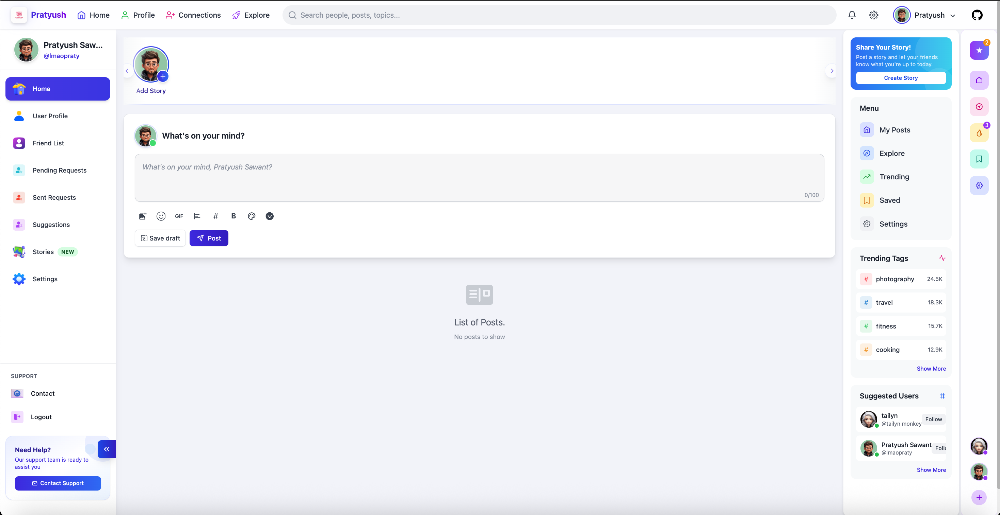

# Social Networking Site - MERN Stack

Welcome to the **Social Networking Site** built using the **MERN Stack** (MongoDB, Express, React, Node.js). This project offers users the ability to connect with each other, share posts, like content, and more, similar to popular social networking platforms.



## 🚀 Live Demo

Check out the live demo of the application [here](https://connectra-nine.vercel.app/).

## 📄 Description

This social networking site allows users to:
- Create an account and log in.
- Post updates, photos, and share content with their connections.
- Like and comment on posts.
- Edit their profiles and update personal information.
- View and manage friend requests.
- See real-time updates from other users on their feed.

## 🛠️ Tech Stack

- **Frontend**: React.js with modern hooks and context for state management.
- **Backend**: Node.js and Express.js.
- **Database**: MongoDB for storing user data, posts, and comments.
- **Authentication**: JWT (JSON Web Token) for secure user authentication.
- **Hosting**: Vercel for deployment of the frontend and backend.
  
## 🔧 Features

- User authentication (login, registration, password hashing).
- Post creation, editing, and deletion.
- Like and comment functionality.
- Real-time feed updates.
- Friend request system.
- Profile management (edit user information, update profile picture).
  
## 🖥️ Setup Instructions

To run the project locally, follow these steps:

1. **Clone the repository**:
    ```bash
    git clone https://github.com/pratyushsawant/SocialMediaApp
    ```

2. **Install dependencies**:
   - Navigate to both the frontend and backend directories and run:
    ```bash
    npm install
    ```

3. **Set up MongoDB**:
   - **Option 1: Local MongoDB (Recommended for development)**
     - Install MongoDB Community Edition:
       ```bash
       brew tap mongodb/brew
       brew install mongodb-community@8.0
       brew services start mongodb-community@8.0
       ```
     - Verify MongoDB is running:
       ```bash
       brew services list | grep mongodb
       ```
   
   - **Option 2: MongoDB Atlas (Cloud - Easier setup)**
     - Create a free account at [MongoDB Atlas](https://www.mongodb.com/cloud/atlas)
     - Create a new cluster and get your connection string
     - Use the connection string in your `.env` file

4. **Set up environment variables**:
   - **Backend**: Create a `.env` file in the `backend` directory:
    ```env
    MONGO_URI=mongodb://localhost:27017
    PORT=8000
    CORS_ORIGIN=http://localhost:3000
    JWT_SECRET=your-super-secret-jwt-key-change-in-production

    CLOUDINARY_CLOUD_NAME=
    CLOUDINARY_API_KEY=
    CLOUDINARY_API_SECRET=
    ```
    > **Note**: For MongoDB Atlas, replace `MONGO_URI` with your Atlas connection string.
   
   - **Frontend**: Create a `.env.local` file in the `frontend` directory:
    ```env
    NEXT_PUBLIC_BACKEND_API=http://localhost:8000

    NEXTAUTH_URL=http://localhost:3000
    GOOGLE_CLIENT_ID=your-google-client-id
    GOOGLE_CLIENT_SECRET=your-google-client-secret
    NEXTAUTH_SECRET=your-nextauth-secret-key
    ```

5. **Start the development server**:
   - Run the backend server:
    ```bash
    npm run dev
    ```
   - Run the frontend React application:
    ```bash
    npm run dev
    ```

6. **Access the app**: 
   - Frontend: Open your browser and go to `http://localhost:3000`
   - Backend API: Available at `http://localhost:8000`
   
   > **Troubleshooting**: If the frontend shows "Please Wait..." and doesn't load:
   > - Make sure MongoDB is running: `brew services list | grep mongodb`
   > - Check that the backend is running and can connect to MongoDB
   > - Verify your `.env.local` file has `NEXT_PUBLIC_BACKEND_API=http://localhost:8000`

## 👨‍💻 Developers

**Pratyush**  
[LinkedIn](https://www.linkedin.com/in/pratyushsawant/)
**Tailyn**
[LinkedIn](linkedin.com/in/tailynb/)

Feel free to check out the live demo and connect with me on LinkedIn!
# Connectra
